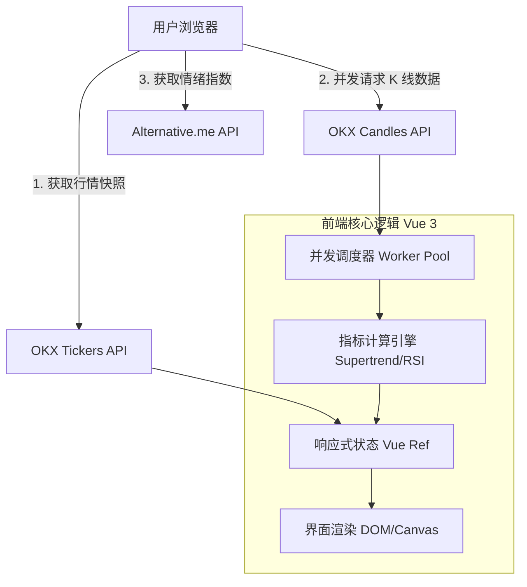

# 🚀 Crypto SuperTrend Dashboard (技术架构报告)

> 一个基于浏览器端实时计算的加密货币超级趋势（SuperTrend）监控看板。

## 1. 项目概述
本项目是一个**单文件 (Single-File)** 的纯前端 Web 应用，旨在为交易者提供实时的加密货币市场趋势分析。它完全运行在用户的浏览器中，直接与 OKX 交易所 API 交互，无需任何后端服务器支持。

**核心价值**：
- **实时性**：直接连接交易所数据源，毫秒级响应。
- **隐私性**：所有选币逻辑和配置保存在本地浏览器（LocalStorage），无数据上传。
- **高性能**：优化的并发请求架构，支持同时监控 250+ 币种的多周期趋势。

---

## 2. 技术架构 (Technical Architecture)

### 2.1 总体架构图 (System Design)
系统采用 **Client-Side Rendering (CSR)** 架构，数据流向如下：



### 2.2 核心技术栈
| 模块 | 技术选型 | 选择理由 |
| :--- | :--- | :--- |
| **核心框架** | **Vue 3 (Composition API)** | 强大的响应式系统，利用 `ref/computed` 高效管理 250+ 币种的复杂状态。 |
| **图表引擎** | **Lightweight Charts** | TradingView 出品的高性能 Canvas 图表库，渲染 K 线和指标极其流畅。 |
| **数据源** | **OKX REST API v5** | 提供丰富且稳定的加密货币公开数据接口。 |
| **样式方案** | **CSS3 / Flexbox / Grid** | 原生 CSS 变量实现深色模式，无第三方 UI 库依赖，保持极度轻量。 |
| **字体** | **Inter** | 现代化的数字显示字体，提升数据可读性。 |

---

## 3. 关键技术挑战与解决方案 (Architecture Evolution)

在项目迭代过程中，我们解决了以下核心技术难点：

### 3.1 ⚡ 并发控制与限流 (Concurrency Control)
*   **问题**：监控 250 个币种 x 5 个周期 = 1250 次 API 请求。如果直接发出，会瞬间触发 OKX 的 HTTP 429 (Too Many Requests) 封禁。
*   **最终架构方案**：**固定窗口并发池 (Fixed Worker Pool)**。
    *   实现了一个包含 8 个并发 Worker 的调度器。
    *   **智能退避 (Smart Backoff)**：一旦检测到 429 错误，所有 Worker 立即暂停并在 2-3 秒后通过随机抖动（Jitter）重试，彻底解决了限流问题。

### 3.2 🌊 平滑刷新体验 (Incremental Hydration)
*   **问题**：用户点击刷新时，如果清空数据重新加载，会导致 UI 剧烈闪烁，体验极差。
*   **最终架构方案**：**状态保留与增量覆盖 (State Preservation)**。
    *   在发起新请求前，建立旧数据的 `Map` 索引。
    *   新列表生成时，优先复用旧的趋势数据和图表。
    *   新数据到达后，原子化地更新响应式对象。
    *   **效果**：用户感觉不到“刷新”动作，只见数据实时跳动更新。

### 3.3 📊 前端实时计算 (Client-Side Computing)
*   **问题**：API 仅提供原始 OHLC (开高低收) 数据，不提供 Supertrend 或 RSI 指标。
*   **最终架构方案**：**浏览器边缘计算**。
    *   在前端实现了完整的 `ATR (Average True Range)`、`Supertrend` 和 `RSI` 算法。
    *   利用现代浏览器的 JavaScript 引擎性能，毫秒级完成数千次指标运算。

### 3.4 🕒 时区与本地化 (Localization)
*   **问题**：API 返回 UTC 时间，且图表库默认处理为 UTC，不符合亚洲用户习惯。
*   **最终架构方案**：**UTC+8 强制校准**。
    *   在数据层：`timestamp + 28800` (8小时)。
    *   在表现层：自定义 `timeFormatter`，格式化为“YYYY年MM月DD日 HH:mm”，符合直觉。

---

## 4. 文件结构与部署

### 4.1 项目结构
本项目采用 **"All-in-One"** 结构，极致精简：
```text
.
├── index.html       # 核心代码 (HTML + CSS + JS 逻辑全包含)
├── README.md        # 项目文档与架构报告
├── LICENSE          # 开源协议
└── .gitignore       # Git 忽略配置
```

### 4.2 如何运行
1.  **本地运行**：直接双击打开 `index.html` 即可。
2.  **在线部署**：直接上传至 GitHub Repository，开启 **GitHub Pages** 即可获得永久免费的 HTTPS 访问链接。

---

## 5. 待办事项 (Roadmap)
- [x] 基础行情与 K 线展示
- [x] Supertrend 多周期计算
- [x] 恐慌贪婪指数集成
- [x] UI/UX 重构 (深色模式, Inter 字体)
- [x] 架构优化 (并发池, 增量刷新)
- [ ] 自选币种 (Watchlist) 持久化存储
- [ ] 价格预警通知

---

## 6. 免责声明
本项目仅供技术研究与学习使用。所有数据来源于第三方 API，不构成任何投资建议。
